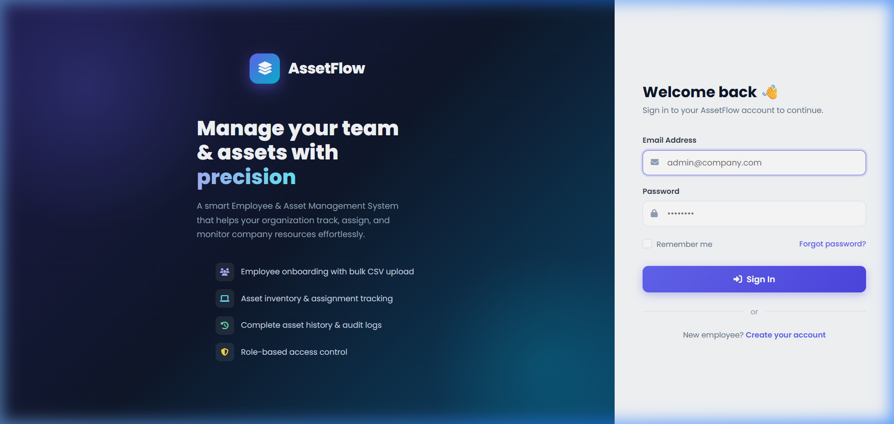
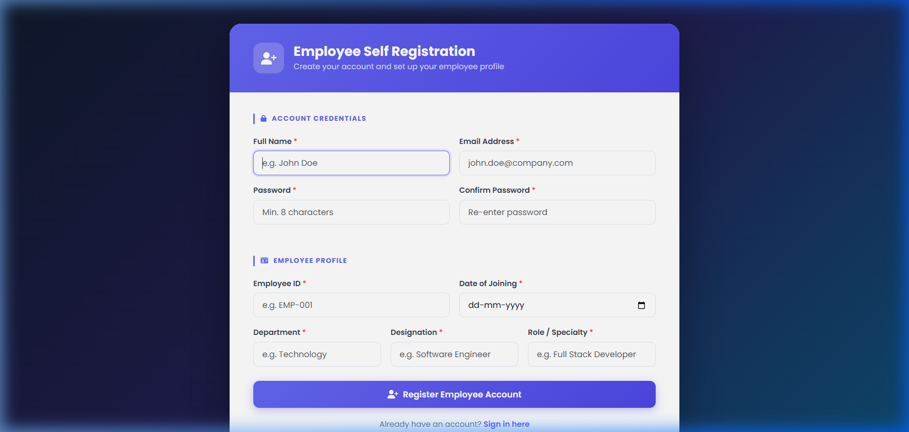
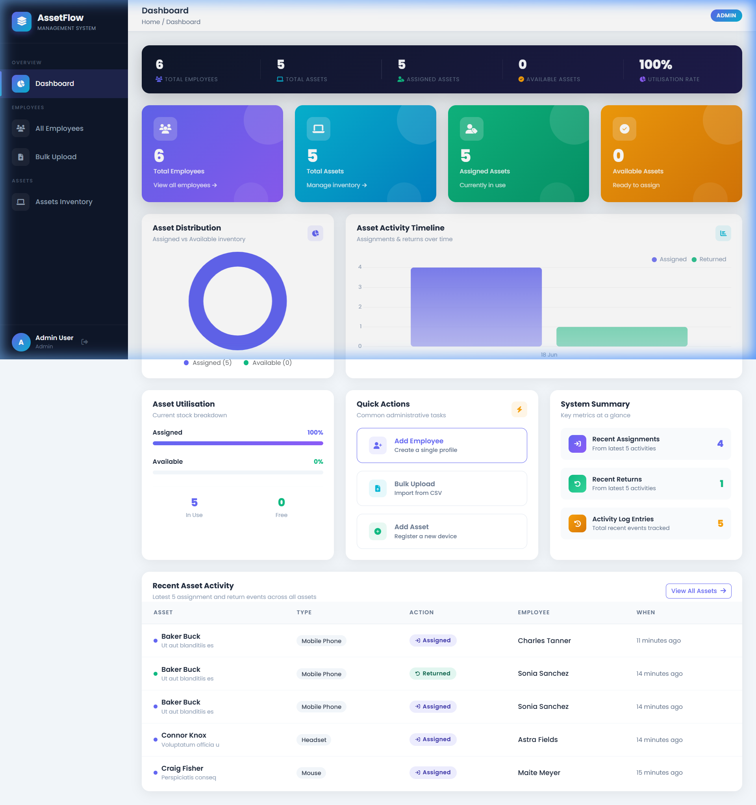
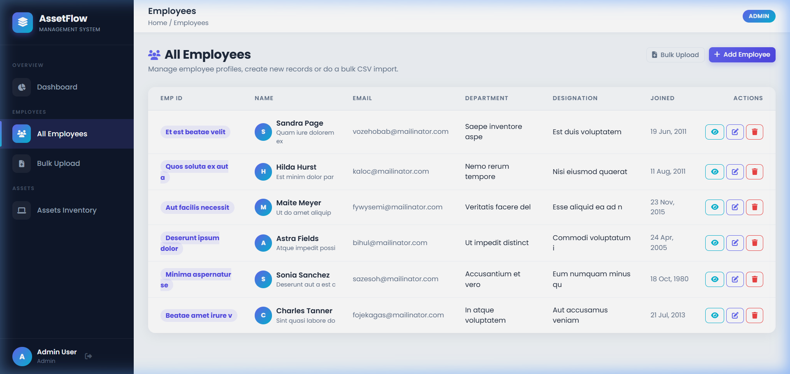
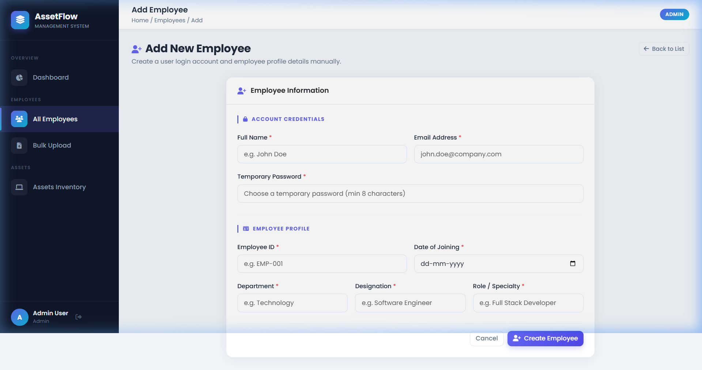
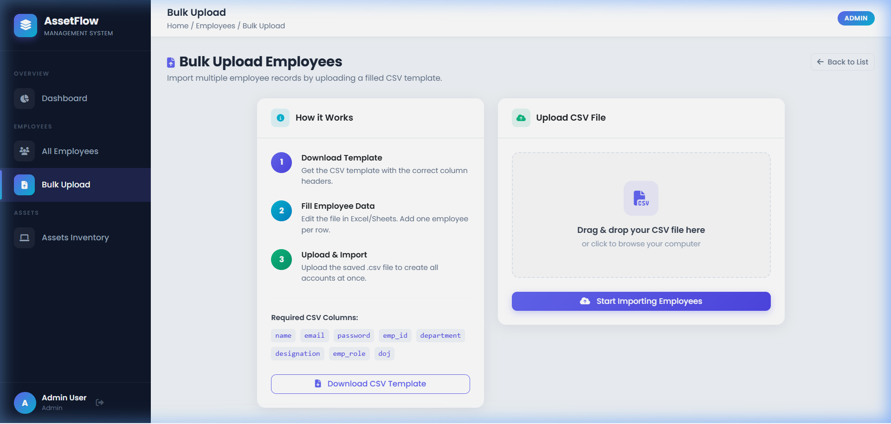
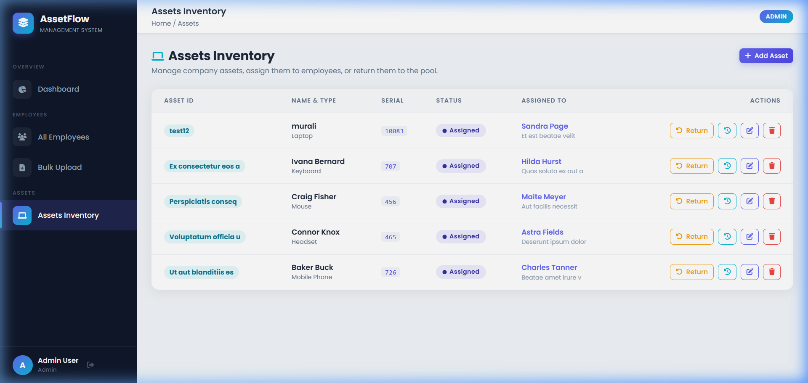
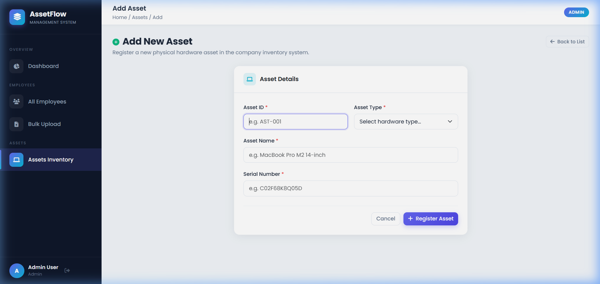

<div align="center">

# 🏢 AssetFlow — Employee & Asset Management System

**A professional Employee & Asset Management System built with Laravel, designed to help organizations track employees, manage hardware inventory, assign assets, and maintain a full audit trail.**

[](https://php.net)
[](https://laravel.com)
[](https://mysql.com)
[](https://getbootstrap.com)
[](https://chartjs.org)
[](LICENSE)

</div>

---

## 📋 Table of Contents

- [About the Project](#-about-the-project)
- [Features](#-features)
- [Technology Stack](#-technology-stack)
- [Screenshots](#-screenshots)
- [Database Schema](#-database-schema)
- [Project Structure](#-project-structure)
- [Getting Started](#-getting-started)
- [Default Credentials](#-default-credentials)
- [Usage Guide](#-usage-guide)
- [Routes Reference](#-routes-reference)
- [CSV Bulk Upload Format](#-csv-bulk-upload-format)
- [License](#-license)

---

## 📖 About the Project

**AssetFlow** is a full-featured Employee & Asset Management System built with Laravel 8. It allows an **Admin** to manage a company's workforce and hardware inventory in one place — from onboarding employees and bulk importing records via CSV, to assigning laptops, monitors, and other hardware to specific employees with a complete audit history.

Employees can also **self-register** and view their own personal dashboard showing their assigned assets and transaction history.

---

## ✨ Features

### 👤 Authentication & Roles
- Secure login via **Laravel Breeze** authentication
- Two roles: **Admin** and **Employee**
- Role-based route protection via custom `AdminMiddleware`
- Employee self-registration with full profile details

### 🧑‍💼 Employee Management (Admin)
- ✅ Create, Read, Update, Delete employee profiles
- ✅ Bulk import employees via **CSV upload** (with row-by-row validation)
- ✅ Download a pre-formatted **CSV template** to get started quickly
- ✅ Auto-create login accounts alongside each employee profile
- ✅ View employee profile with currently assigned assets
- ✅ Return assets directly from the employee profile page

### 💻 Asset Management (Admin)
- ✅ Register hardware assets (Laptop, Monitor, Keyboard, Mouse, Headset, Mobile, Other)
- ✅ View full asset inventory with live status badges (**Available** / **Assigned**)
- ✅ **Assign assets** to any employee with an inline dropdown select
- ✅ **Return assets** back to the available pool in one click
- ✅ Full **Asset History** — every assignment and return is logged with timestamp, employee, and notes
- ✅ Edit and delete assets

### 📊 Admin Dashboard
- Dark KPI strip with live counts and utilisation rate
- 4 gradient stat cards (Employees, Assets, Assigned, Available)
- **Chart.js** charts:
  - 🍩 **Donut chart** — Asset distribution (Assigned vs Available)
  - 📊 **Bar chart** — Activity timeline (assignments & returns by date)
- Asset Utilisation progress bars
- System Summary panel (recent assignments, returns, log entries)
- Recent activity feed with coloured dots and relative timestamps
- Quick Action buttons for common tasks

### 🙋 Employee Dashboard
- Personalised welcome banner with stats
- Personal profile information card with icon rows
- List of currently assigned hardware assets
- Complete personal asset transaction history

---

## 🛠 Technology Stack

| Layer          | Technology                           |
|----------------|--------------------------------------|
| **Backend**    | PHP 8.0+, Laravel 8.x                |
| **Auth**       | Laravel Breeze                       |
| **Frontend**   | Blade Templates, Bootstrap 5.3 (CDN) |
| **Charts**     | Chart.js 4.4 (CDN)                   |
| **Fonts**      | Google Fonts — Poppins               |
| **Icons**      | Font Awesome 6 (CDN)                 |
| **Database**   | MySQL 8.0                            |
| **ORM**        | Laravel Eloquent                     |
| **Dev Server** | XAMPP / PHP built-in server          |

---

## 📸 Screenshots

### 1. 🔐 Login Page



**What you see:**
- **Split-screen layout** — dark gradient left panel with product branding and feature highlights on the left; a clean white sign-in form on the right
- **Left panel** showcases the 4 key features: Employee onboarding, Asset tracking, Audit history, and Role-based access control — each with a coloured icon
- **Right panel** contains the email + password form with "Remember me", "Forgot password?" link, and a "Create your account" link for new employee self-registration
- The gradient transitions from deep indigo → dark navy → teal, giving a professional SaaS feel

---

### 2. 📝 Employee Registration Page



**What you see:**
- A centred card on a deep dark gradient background
- **Header band** in indigo gradient with a user-plus icon
- Two clearly separated sections:
  - **Account Credentials** — Name, Email, Password, Confirm Password
  - **Employee Profile** — Employee ID, Date of Joining, Department, Designation, Role/Specialty
- Section labels with a purple left-border accent and uppercase text
- Employees self-register here; the admin can also create accounts from the admin panel

---

### 3. 📊 Admin Dashboard



**What you see:**
- **Dark KPI Strip** at the top — shows Total Employees, Total Assets, Assigned Assets, Available Assets, and Utilisation Rate all in one row on a dark indigo background
- **4 Gradient Stat Cards** below — each in a different colour (purple, teal, green, amber) with large numbers and a subtle circular highlight
- **Chart Row:**
  - Left: **Donut Chart** showing asset distribution (Assigned in purple vs Available in green)
  - Right: **Bar Chart** showing the activity timeline — grouped bars for assignments and returns by date
- **Second Row:**
  - **Asset Utilisation** — horizontal progress bars for Assigned % and Available %
  - **Quick Actions** — three action buttons (Add Employee, Bulk Upload, Add Asset)
  - **System Summary** — three metric tiles showing Recent Assignments, Recent Returns, and Activity Log Entries
- **Recent Activity Table** at the bottom — last 5 events with coloured dot indicators, asset name, type badge, action badge (Assigned/Returned), employee name, and relative timestamps

---

### 4. 👥 Employees List



**What you see:**
- **Page header** with title, description, and two action buttons (Bulk Upload + Add Employee)
- **Dark sidebar** is always visible with active route highlighted
- **Data table** with columns: Emp ID, Name, Email, Department, Designation, Joined, Actions
- **Emp ID** is shown as a purple pill badge
- **Name column** shows a gradient avatar circle with the employee's initial, name in bold, and their role below in smaller grey text
- **Action buttons** at the end of each row: View (cyan), Edit (blue), Delete (red)
- **Empty state** shows a centred icon with message and call-to-action buttons when no employees exist

---

### 5. ➕ Add Employee Form



**What you see:**
- Centred card layout with a clear header row
- **Two sections** clearly divided by a horizontal rule:
  1. **Account Credentials** — Full Name, Email Address, Temporary Password (all required, marked with red asterisks)
  2. **Employee Profile** — Employee ID, Date of Joining, Department, Designation, Role/Specialty
- Section labels styled with a purple left-border accent and uppercase letter-spacing
- All inputs have rounded borders with purple focus rings
- **Footer actions** — Cancel (ghost button) and Create Employee (primary gradient button)

---

### 6. 📤 Bulk Upload Employees



**What you see:**
- **Two-column layout:**
  - **Left — "How it Works"** card with numbered step indicators (1, 2, 3) in gradient circles: Download Template → Fill Data → Upload & Import
  - Below the steps: list of required CSV columns shown as code badges
  - **Download CSV Template** button at the bottom
  - **Right — Upload** card with a drag-and-drop zone with dashed border, file CSV icon, and instruction text
- The drop zone changes border colour and background on hover/drag
- On file select, the filename is displayed inside the drop zone
- **Start Importing Employees** primary button below the drop zone
- If there are validation errors from a previous import, they appear as a dismissible error alert above the upload form

---

### 7. 💻 Assets Inventory



**What you see:**
- **Page header** with title and "+ Add Asset" primary button
- **Data table** with columns: Asset ID, Name & Type, Serial, Status, Assigned To, Actions
- **Asset ID** shown as a teal pill badge
- **Name & Type** column — asset name in bold with device type below in grey
- **Status** — green pill for "Available", indigo pill for "Assigned"
- **Assigned To** — clickable employee name in purple with their Emp ID below; dash if unassigned
- **Actions column** (when Assigned): Return button (amber outline) + History icon (cyan) + Edit icon (blue) + Delete icon (red)
- **Actions column** (when Available): Inline employee dropdown select + Assign button (green) + History + Edit + Delete

---

### 8. ➕ Add Asset Form



**What you see:**
- Centred card with a teal laptop icon in the header
- **Grid layout** — Asset ID and Asset Type side by side
- **Asset Type** is a dropdown select with options: Laptop, Monitor, Keyboard, Mouse, Headset, Mobile Phone, Other
- Full-width **Asset Name** and **Serial Number** fields below
- Footer with Cancel (ghost) and Register Asset (gradient primary) buttons
- Clean, minimal form with rounded inputs and purple focus rings

---

## 🗄 Database Schema

Only **3 database tables** are used as per requirements:

### `users`
| Column       | Type      | Notes                        |
|--------------|-----------|------------------------------|
| `id`         | BIGINT PK | Auto-increment               |
| `name`       | VARCHAR   | Full name                    |
| `email`      | VARCHAR   | Unique, used for login       |
| `password`   | VARCHAR   | Bcrypt hashed                |
| `role`       | ENUM      | `admin` or `employee`        |
| `timestamps` | —         | created_at, updated_at       |

### `employees`
| Column        | Type      | Notes                              |
|---------------|-----------|------------------------------------|
| `id`          | BIGINT PK | Auto-increment                     |
| `user_id`     | BIGINT FK | References `users.id`, nullable    |
| `emp_id`      | VARCHAR   | Unique, e.g. `EMP-001`             |
| `name`        | VARCHAR   | Display name                       |
| `department`  | VARCHAR   | e.g. Technology                    |
| `designation` | VARCHAR   | e.g. Software Engineer             |
| `emp_role`    | VARCHAR   | e.g. Full Stack Developer          |
| `doj`         | DATE      | Date of joining                    |
| `timestamps`  | —         | created_at, updated_at             |

### `assets`
| Column          | Type      | Notes                                            |
|-----------------|-----------|--------------------------------------------------|
| `id`            | BIGINT PK | Auto-increment                                   |
| `asset_id`      | VARCHAR   | Unique code, e.g. `AST-001`                      |
| `name`          | VARCHAR   | Device name, e.g. MacBook Pro M2                 |
| `type`          | VARCHAR   | Laptop / Monitor / Keyboard / etc.               |
| `serial_number` | VARCHAR   | Unique hardware serial                           |
| `status`        | ENUM      | `available` or `assigned`                       |
| `employee_id`   | BIGINT FK | References `employees.id`, nullable              |
| `history`       | JSON      | Full audit log — all assignment/return events    |
| `timestamps`    | —         | created_at, updated_at                           |

> **Note:** Asset history (assignments & returns) is stored as a **JSON column** within the `assets` table to keep the schema to exactly 3 tables as required.

---

## 📁 Project Structure

```
tecdata-task/
├── app/
│   ├── Http/
│   │   ├── Controllers/
│   │   │   ├── Auth/
│   │   │   │   └── RegisteredUserController.php   # Employee self-registration
│   │   │   ├── AdminDashboardController.php        # Admin dashboard stats & charts
│   │   │   ├── AssetController.php                 # Asset CRUD, assign, return, history
│   │   │   ├── EmployeeController.php              # Employee CRUD & bulk CSV upload
│   │   │   └── EmployeeDashboardController.php     # Employee self-service dashboard
│   │   └── Middleware/
│   │       └── AdminMiddleware.php                 # Restricts admin-only routes
│   └── Models/
│       ├── User.php
│       ├── Employee.php
│       └── Asset.php
├── database/
│   ├── migrations/
│   │   ├── ..._create_users_table.php
│   │   ├── ..._create_employees_table.php
│   │   └── ..._create_assets_table.php
│   └── seeders/
│       └── DatabaseSeeder.php                     # Seeds default admin account
├── docs/
│   └── screenshots/                               # All UI screenshots for README
├── resources/views/
│   ├── layouts/
│   │   └── app.blade.php                          # Main layout with sidebar
│   ├── auth/
│   │   ├── login.blade.php                        # Split-screen login page
│   │   └── register.blade.php                     # Employee registration form
│   ├── admin/
│   │   ├── dashboard.blade.php                    # Admin dashboard with charts
│   │   ├── employees/                             # Employee CRUD views
│   │   └── assets/                                # Asset CRUD & history views
│   └── employee/
│       └── dashboard.blade.php                    # Employee self-service dashboard
├── routes/
│   ├── web.php                                    # Main routes
│   └── auth.php                                   # Breeze auth routes
└── test_employees.csv                             # Sample CSV for bulk upload testing
```

---

## 🚀 Getting Started

### Prerequisites

- **PHP** >= 8.0
- **Composer** >= 2.0
- **MySQL** >= 8.0 (or MariaDB)
- **XAMPP** (recommended) or any LAMP/LEMP stack

### Installation

**1. Clone the repository**
```bash
git clone https://github.com/your-username/tecdata-task.git
cd tecdata-task
```

**2. Install PHP dependencies**
```bash
composer install
```

**3. Copy the environment file**
```bash
cp .env.example .env
```

**4. Generate the application key**
```bash
php artisan key:generate
```

**5. Configure the database** — open `.env` and set:
```env
DB_CONNECTION=mysql
DB_HOST=127.0.0.1
DB_PORT=3306
DB_DATABASE=tecdata_task
DB_USERNAME=root
DB_PASSWORD=
```

**6. Create the database**
```sql
CREATE DATABASE tecdata_task;
```

**7. Run migrations and seed**
```bash
php artisan migrate --seed
```

### Running the App

**Option A — XAMPP**

Place the project in `C:\xampp8.2\htdocs\tecdata-task` and visit:
```
http://localhost/tecdata-task/public/
```

**Option B — PHP built-in server**
```bash
php artisan serve
```
Then open `http://localhost:8000`

---

## 🔑 Default Credentials

After `php artisan migrate --seed`:

| Role      | Email                 | Password   |
|-----------|-----------------------|------------|
| **Admin** | `admin@example.com`   | `admin123` |

> ⚠️ Change the admin password after first login in production.

Employees self-register at `/register` or are created/imported by the admin.

---

## 📖 Usage Guide

### Admin Workflow

1. **Login** → use admin credentials above
2. **Dashboard** → view live stats, charts, and recent activity
3. **Employees → All Employees** → view and manage the employee list
4. **Employees → Add Employee** → create a single employee with login account
5. **Employees → Bulk Upload** → download template → fill data → upload CSV
6. **Assets → Assets Inventory** → manage hardware inventory
7. **Assets → Add Asset** → register a new device
8. **Assets → Assign** → use the inline dropdown + Assign button on the asset row
9. **Assets → History** → click the clock icon to view full asset audit log

### Employee Workflow

1. **Self-register** at `/register` with profile details
2. **Login** → automatically redirected to personal dashboard
3. **My Dashboard** → view profile, assigned assets, and full transaction history

---

## 🗺 Routes Reference

### Public Routes
| Method | URI         | Description              |
|--------|-------------|--------------------------|
| GET    | `/`         | Redirects to login       |
| GET    | `/login`    | Login page               |
| POST   | `/login`    | Authenticate user        |
| GET    | `/register` | Employee self-register   |
| POST   | `/register` | Create employee account  |
| POST   | `/logout`   | Log out                  |

### Admin Routes (`auth` + `admin` middleware, prefix `/admin`)
| Method    | URI                                  | Description                     |
|-----------|--------------------------------------|---------------------------------|
| GET       | `/admin/dashboard`                   | Admin dashboard with charts     |
| GET       | `/admin/employees`                   | List all employees              |
| GET       | `/admin/employees/create`            | Add employee form               |
| POST      | `/admin/employees`                   | Store new employee              |
| GET       | `/admin/employees/{id}`              | View employee profile           |
| GET       | `/admin/employees/{id}/edit`         | Edit employee form              |
| PUT       | `/admin/employees/{id}`              | Update employee                 |
| DELETE    | `/admin/employees/{id}`              | Delete employee                 |
| GET       | `/admin/employees/upload`            | Bulk upload form                |
| POST      | `/admin/employees/upload`            | Process CSV import              |
| GET       | `/admin/employees/download-template` | Download CSV template           |
| GET       | `/admin/assets`                      | Asset inventory list            |
| GET       | `/admin/assets/create`               | Add asset form                  |
| POST      | `/admin/assets`                      | Store new asset                 |
| GET       | `/admin/assets/{id}/edit`            | Edit asset form                 |
| PUT       | `/admin/assets/{id}`                 | Update asset                    |
| DELETE    | `/admin/assets/{id}`                 | Delete asset                    |
| POST      | `/admin/assets/{id}/assign`          | Assign asset to employee        |
| POST      | `/admin/assets/{id}/return`          | Return asset to pool            |
| GET       | `/admin/assets/{id}/history`         | Asset assignment history        |

### Employee Routes (`auth` middleware, prefix `/employee`)
| Method | URI                    | Description              |
|--------|------------------------|--------------------------|
| GET    | `/employee/dashboard`  | Employee self-service    |

---

## 📄 CSV Bulk Upload Format

Download the template from **Admin → Employees → Bulk Upload → Download CSV Template**, or use this format:

```csv
name,email,password,emp_id,department,designation,emp_role,doj
John Doe,john@company.com,Secret123,EMP-001,Technology,Software Engineer,Full Stack Developer,2024-01-15
Jane Smith,jane@company.com,Secret123,EMP-002,HR,HR Manager,Talent Acquisition,2024-02-01
```

**Rules:**
- All 8 columns are **required** on every row
- `emp_id` and `email` must be **unique** across the entire database
- `doj` must be a valid date in `YYYY-MM-DD` format
- `password` must be at least 8 characters
- The import is **all-or-nothing** — if any row fails validation, the entire file is rejected and all errors are reported

A sample file `test_employees.csv` is included in the project root for testing.

---

## 🤝 Contributing

1. Fork the project
2. Create your feature branch (`git checkout -b feature/AmazingFeature`)
3. Commit your changes (`git commit -m 'Add some AmazingFeature'`)
4. Push to the branch (`git push origin feature/AmazingFeature`)
5. Open a Pull Request

---

## 📜 License

This project is licensed under the **MIT License**.

---

<div align="center">

**Built with ❤️ using Laravel 8 · Bootstrap 5 · Chart.js · Poppins · Font Awesome 6**

</div>


